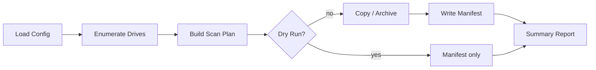

# Technical Specification — Windows Personal File Archive

**Project:** `windows_find_personal_files`  
**Package name:** `windows_personal_archive`  
**CLI name:** `wpa` (Windows Personal Archive)  
**Version:** 0.1.0 (draft)  
**Companion:** `docs/REQUIREMENTS.md`

---

## 1. Overview

`wpa` is a Python CLI that scans local Windows drives, identifies personal/user data, copies files into a structured archive, and emits a manifest for audit and restore. It is designed to be open source, spec-driven, and CI-gated per the project boilerplate.

### 1.1 High-Level Pipeline



---

## 2. Archive Layout

Archive root (user-chosen output path). Example: `E:\migration_2026-06-16\` or a single `migration.zip`.

```
<migration_root>/
├── META/
│   ├── manifest.json          # Full inventory (see §5)
│   ├── manifest.jsonl         # Optional line-delimited for huge sets
│   ├── summary.txt            # Human-readable run summary
│   ├── wpa.log                # Structured run log
│   ├── config.snapshot.json   # Effective config at run time
│   └── version.json           # Tool version, source OS, hostname
├── USERS/
│   └── <username>/
│       ├── PROFILE/           # Known profile folders (Documents, Pictures, ...)
│       │   └── ...            # Mirrors relative path under profile
│       └── APPDATA/
│           ├── Roaming/
│           ├── Local/
│           └── LocalLow/
├── DRIVE_ROOTS/               # Personal files outside profile on each drive
│   └── <drive>_/             # e.g. D_/Projects/foo → DRIVE_ROOTS/D_/Projects/foo
└── README_RESTORE.md          # Copied from project docs at archive time
```

**Path mapping rule:** Archive path = category prefix + sanitized drive-relative path. Drive letter `D:` becomes `D_` in folder names to avoid `:` issues on some filesystems.

**Restore mapping (default):** `USERS/<username>/PROFILE/Documents/foo.docx` → `C:\Users\<username>\Documents\foo.docx` on target (configurable base drive and username).

---

## 3. Module Architecture

```
src/windows_personal_archive/
├── __init__.py
├── __main__.py              # Entry: python -m windows_personal_archive
├── cli/
│   ├── __init__.py
│   └── main.py              # Typer/argparse CLI: scan, archive, verify
├── config/
│   ├── __init__.py
│   ├── models.py            # Frozen dataclasses: ArchiveConfig, ExcludeRules
│   └── loader.py            # Env + TOML/YAML load
├── drives/
│   ├── __init__.py
│   └── enumerate.py         # Fixed drive discovery (Windows only)
├── scan/
│   ├── __init__.py
│   ├── planner.py           # Inclusion/exclusion → file iterator
│   ├── rules.py             # Default + custom glob/prefix rules
│   └── classify.py          # Category assignment
├── archive/
│   ├── __init__.py
│   ├── writer.py            # Copy to folder layout or zip stream
│   ├── zip_writer.py
│   └── path_map.py          # Source → archive path mapping
├── manifest/
│   ├── __init__.py
│   ├── models.py            # ManifestEntry (frozen dataclass)
│   └── writer.py            # JSON / JSONL output
├── verify/
│   ├── __init__.py
│   └── checksum.py          # Optional SHA-256 pass
└── platform/
    ├── __init__.py
    ├── windows.py           # Win-specific: long paths, ACL hints
    └── stub.py              # Non-Windows stub for CI tests
```

**Principles:**

- Thin `cli/main.py` — parse args, load config, dispatch.
- Business logic in `scan`, `archive`, `manifest` — no CLI imports in core modules.
- `platform/windows.py` isolated so Linux CI can test rules/manifest with `stub.py`.

---

## 4. Default Scan Rules

### 4.1 Drives

- Include: all **fixed local** drives (`DRIVE_FIXED`).
- Exclude: network drives, removable (unless `--include-removable`).

### 4.2 Global Exclusions (path prefix or segment)

| Pattern | Reason |
|---------|--------|
| `\Windows\` | OS |
| `\Program Files\` | Applications |
| `\Program Files (x86)\` | Applications |
| `\ProgramData\` | Shared app data (mostly non-personal; overridable) |
| `\$Recycle.Bin\` | Trash |
| `\System Volume Information\` | System |
| `\Windows\WinSxS\` | Component store |
| `\AppData\Local\Temp\` | Temp |
| `\AppData\Local\Microsoft\Windows\INetCache\` | Browser cache |
| `pagefile.sys`, `hiberfil.sys` | System files |

### 4.3 Global Inclusions (when under a user profile or explicit drive scan)

| Relative path | Category |
|---------------|----------|
| `Desktop`, `Documents`, `Pictures`, `Videos`, `Music`, `Downloads` | `media` / `documents` |
| `AppData\Roaming` | `config` |
| `AppData\Local` (minus exclusions) | `config` |
| `AppData\LocalLow` | `config` |
| `.ssh`, `.gnupg` (if present in profile) | `credentials-adjacent` |

### 4.4 Known Application Paths (v1.1 optional module)

Explicit inclusion lists for Chrome, Firefox, Thunderbird, Outlook data files — configurable via `known_apps.toml`. v1 uses generic AppData scan; known_apps improves classification only.

---

## 5. Manifest Schema

`manifest.json` top-level:

```json
{
  "schema_version": "1.0",
  "tool_version": "0.1.0",
  "created_at": "2026-06-16T12:00:00Z",
  "source": {
    "hostname": "SOURCE-PC",
    "os": "Windows 10",
    "drives": ["C:", "D:"]
  },
  "config_snapshot_path": "META/config.snapshot.json",
  "entries": [ /* ManifestEntry[] */ ],
  "stats": {
    "files_copied": 0,
    "files_skipped": 0,
    "bytes_copied": 0,
    "errors": 0
  }
}
```

`ManifestEntry` fields:

| Field | Type | Description |
|-------|------|-------------|
| `source_path` | string | Absolute path on source |
| `archive_path` | string | Relative path inside archive |
| `category` | string | Classification enum |
| `size_bytes` | int | File size |
| `modified_at` | string | ISO 8601 |
| `status` | enum | `copied`, `skipped`, `error` |
| `status_reason` | string? | Skip/error reason |
| `sha256` | string? | Optional hash |

---

## 6. CLI Specification

Binary name: `wpa` (console script entry point).

### 6.1 Commands

| Command | Description |
|---------|-------------|
| `wpa scan` | Enumerate and write manifest only (dry-run) |
| `wpa archive` | Scan + copy to archive layout |
| `wpa verify` | Verify archive against manifest (hashes if present) |

### 6.2 Global Options

| Option | Env var | Default |
|--------|---------|---------|
| `--config PATH` | `WPA_CONFIG` | None (use defaults) |
| `--output PATH` | `WPA_OUTPUT` | Required for archive |
| `--dry-run` | `WPA_DRY_RUN` | false |
| `--include-removable` | `WPA_INCLUDE_REMOVABLE` | false |
| `--hash` | `WPA_HASH` | false |
| `--users LIST` | `WPA_USERS` | all non-system profiles |
| `--verbose` | `WPA_VERBOSE` | false |
| `--log-file PATH` | `WPA_LOG_FILE` | `<output>/META/wpa.log` |

### 6.3 Exit Codes

| Code | Meaning |
|------|---------|
| 0 | Success |
| 1 | Operational error (config, paths) |
| 2 | Partial success (some files failed; see log) |
| 3 | Fatal error |

---

## 7. Configuration File

Default filename: `wpa.toml` (TOML preferred; YAML optional).

```toml
[archive]
output_format = "folder"  # "folder" | "zip"
zip_split_size_gb = 0     # 0 = no split

[scan]
include_removable = false
users = ["thoma"]         # empty = all users

[[scan.exclude]]
path_prefix = "C:\\Games\\Steam"  # example user exclude

[[scan.include]]
path_prefix = "D:\\Projects"
category = "documents"
```

Loaded into frozen `ArchiveConfig` dataclass; snapshot written to `META/config.snapshot.json` on run.

---

## 8. Dependencies (Python)

Managed exclusively via `uv` in `pyproject.toml`:

| Package | Use |
|---------|-----|
| `typer` | CLI |
| `rich` | Progress / tables (optional, dev UX) |

**No** `requirements.txt`. Stdlib preferred: `pathlib`, `json`, `zipfile`, `hashlib`, `logging`, `dataclasses`.

Windows-only APIs: `ctypes` / `winreg` only inside `platform/windows.py`.

---

## 9. Testing Strategy

| Layer | Location | Focus |
|-------|----------|-------|
| Unit | `tests/unit/` | `rules.py`, `path_map.py`, `classify.py`, config loader |
| Integration | `tests/integration/` | Fixture tree → scan → manifest |
| Platform | `tests/windows/` (optional CI job) | Real drive enum on `windows-latest` |

Fixtures: synthetic directory trees in `tests/fixtures/` mimicking `Users/thoma/Documents/...`.

Coverage target: ≥90% on `scan/`, `manifest/`, `archive/path_map.py` (not on Windows API glue).

---

## 10. CI Pipeline

GitHub Actions workflow `.github/workflows/ci.yml`:

1. `uv sync`
2. `ruff check` + `ruff format --check`
3. `pyright` (strict)
4. `pytest`
5. (Optional) `windows-latest` — smoke `wpa scan --dry-run` on fixture path

---

## 11. Repository Structure

```
windows_find_personal_files/
├── .github/workflows/ci.yml
├── .gitignore
├── README.md
├── LICENSE                    # MIT (pending confirmation)
├── pyproject.toml
├── docs/
│   ├── REQUIREMENTS.md
│   ├── SPEC.md
│   ├── RESTORE.md             # Windows 10 restore guide (stub)
│   └── feature_bloat/         # Abandoned approaches
├── src/windows_personal_archive/   # as §3
├── tests/
│   ├── unit/
│   ├── integration/
│   └── fixtures/
└── scripts/
    └── bootstrap.ps1          # uv install + sync for Windows users
```

---

## 12. Git & Open Source

- **Branching:** `main` stable; features on `feature/<name>`.
- **Commits:** Atomic, conventional prefixes (`feat:`, `fix:`, `docs:`, `test:`).
- **Release:** Tags `v0.1.0` with changelog in GitHub Releases.
- **Open source:** Public repo; CONTRIBUTING.md in follow-up; no secrets in tree.

---

## 13. Security Considerations

- Archives may contain **passwords, keys, and PII** — README must warn users to encrypt external media and restrict access.
- Tool must not upload data anywhere.
- Logs must not echo file contents.
- `credentials-adjacent` category flagged in summary for user review before sharing archive.

---

## 14. Document History

| Version | Date | Changes |
|---------|------|---------|
| 0.1.0 | 2026-06-16 | Initial technical spec |
